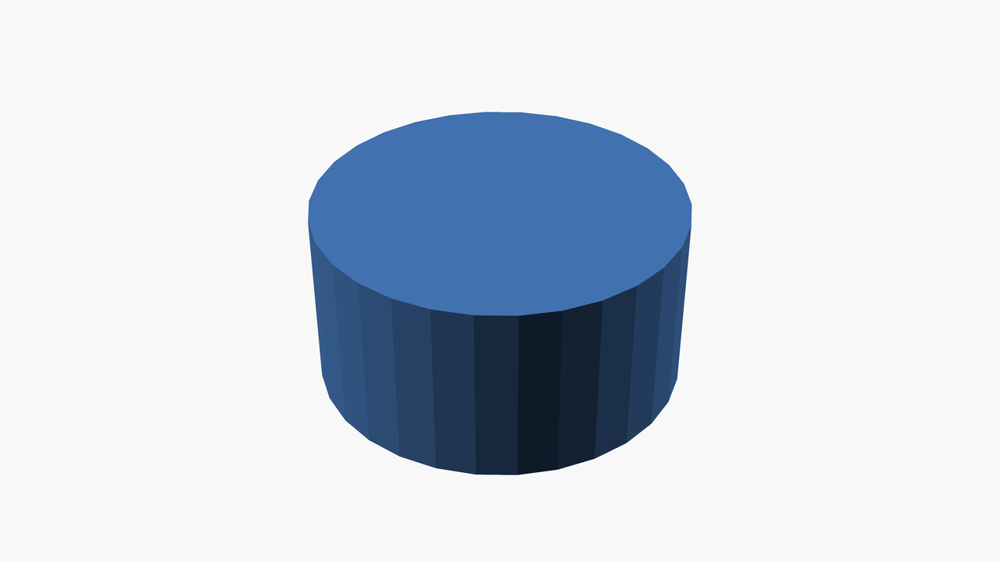
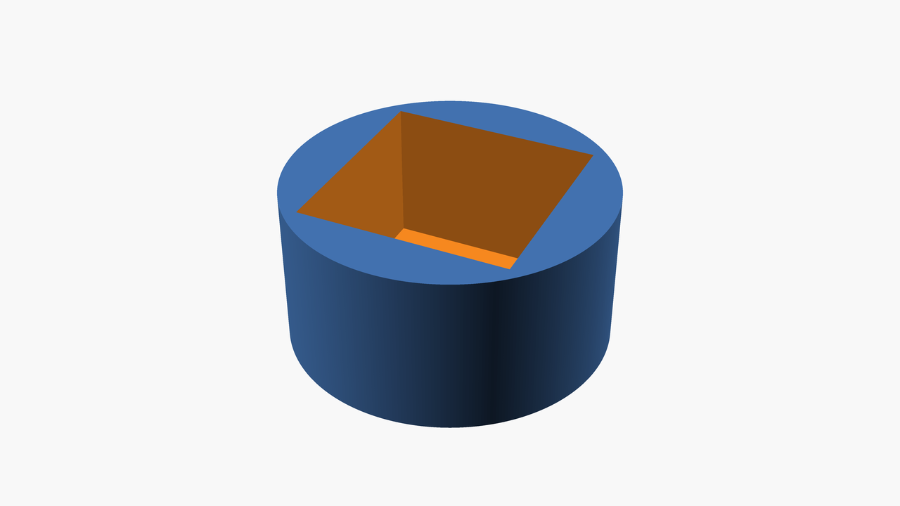
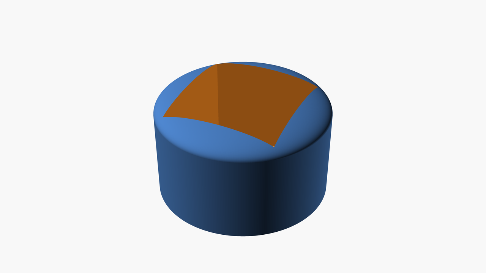

# 1st design

This design shows how to create a printable 3D object that uses boolean combinations, transformations and basic 3D shapes.

# 1st-design-step1.scad

This step is the "hello world" example in OpenSCAD. It's a single line using `cylinder()`:

```
cylinder(h = 20, r1 = 20, r2 = 20, center = true);
```

[Output STL file in 3D preview](./1st-design-step1.stl)



# 1st-design-step2.scad

This step adds a hole in the cylinder, keeping the base of the cylinder filled:

```
difference() {
  cylinder(h = 20, r1 = 20, r2 = 20, center = true);

  translate([0, 0, 12])
    cube([26, 26, 40], center = true);
};
```

It also makes the objects more smooth by setting the special `$fa` and `$fs` variables:

```
$fa = 1;
$fs = 0.1;
```

[Output STL file in 3D preview](./1st-design-step2.stl)



# 1st-design-step3.scad

The last step adds a sphere at the top of the design to make the upper part of the object more smooth.

[Output STL file in 3D preview](./1st-design-step3.stl)


