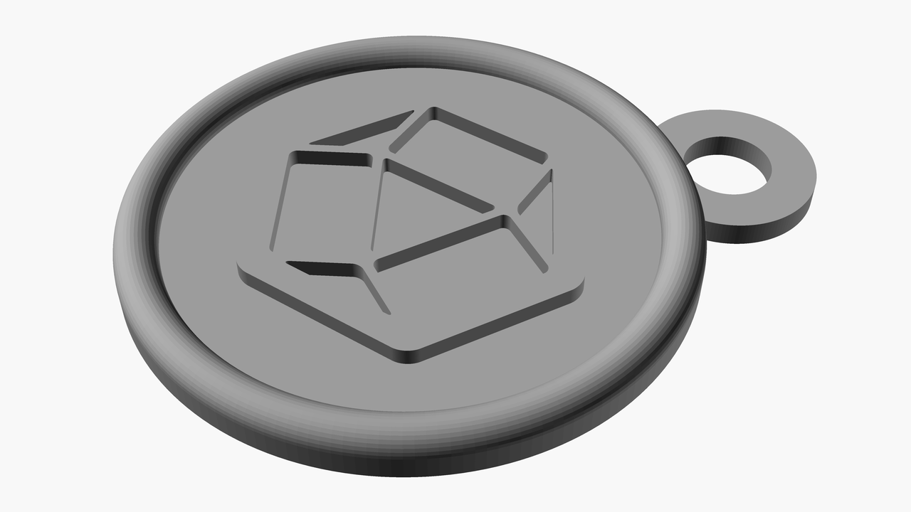

# Designs for 3D prints 

I've created this repository to store and share designs for 3D prints that I have created using OpenSCAD.

The goal is to make some of the designs I've made and consider useful publicly available.

I am focusing on creating single color designs that help me improve small things in my life.

# Index of subdirectories

* [1st design](1st-design/)

    
    
    

* [Card holder](card-holder/)

    

* [Image based keychain](image-based-keychain/)

    

* [Minimalistic picture hanger](minimal-picture-hanger/)

    

* [Surface Pen cap](surface-pen-cap/)

    

* [Password storer](password-storer/)

    

* [Three part container](three-part-container/)

    
    
    
