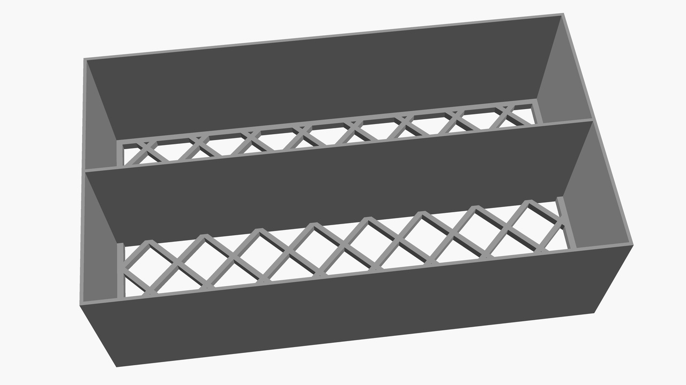

# Card holder

Design for putting various less used membership or debit / credit cards.

This hanger can be customized using the OpenSCAD variables documented below.

# card-holder.scad

[Output STL file in 3D preview](./card-holder.stl)

## Customizations

The following are variables that can be customized in the OpenSCAD file:

| Variable             | Default | Unit | Description                                                                                                       |
|----------------------|---------|------|-------------------------------------------------------------------------------------------------------------------|
| box_width            | 100     | mm   | Width of the card holder (external size, internal size is slightly smaller due to frames)                         |
| box_depth            | 55      | mm   | Height of the card holder (external size, internal size is slightly smaller due to frames)                        |
| box_height           | 32      | mm   | Width of the card holder (external size, internal size is slightly smaller due to frames)                         | 
| middle_offset        | 0       | mm   | The offset of the separator in the middle, to allow for more space on one side and less on the other side         |
