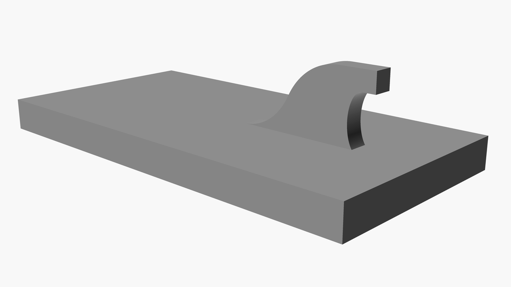

# Minimalistic picture hanger

This is a minimalistic hanger that can be used to hang frames on your wall.

This hanger can be tweaked using the OpenSCAD variables documented below.

# minimal-picture-hanger.scad

[Output STL file in 3D preview](./minimal-picture-hanger.stl)

**NOTE**: This design has to be printed with supports enabled.

## Customizations

The following are key variables that can be customized in the OpenSCAD file:

| Variable             | Default | Unit | Description                                                                                                       |
|----------------------|---------|------|-------------------------------------------------------------------------------------------------------------------|
| width                | 20      | mm   | Width of the hanger base                                                                                          |
| height               | 40      | mm   | Height of the hanger base                                                                                         |
| depth                | 3       | mm   | Depth of the hanger base                                                                                          |
| hanger_offset        | 4.0     | mm   | The offset of the hanger, relative to end of the entire object ; can be used to adapt to different picture frames |
| hanger_diameter      | 1.8     | mm   | Thickness (width) of the hanger                                                                                   |
| hanger_length        | 2.5     | mm   | Length of the end of the hanger itself ; can be changed to adapt to different types of picture frames             |
| hanger_length2       | 1       | mm   | Length of hanger's inner, thick element ; can be increased to increase stability of the hanger                    |
| hanger_height        | 3       | mm   | Height of the hanger from its base                                                                                |
| hanger_length_cosine | 10      | mm   | Height of the lower part of the hanger - the smooth ending                                                        |
