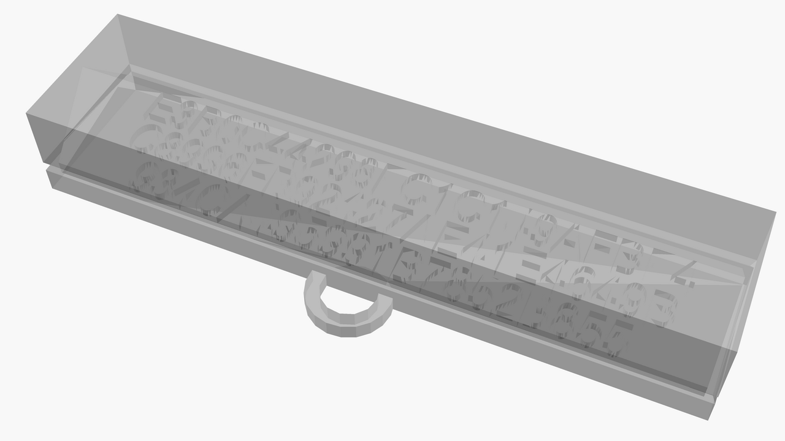

# Password storer

A design that allows keeping a secret as a 3D printout, where the secret is kept inside the object, not being visible externally.

In order to retrieve the secret, the cube will have to be physically cut with sharp objects like a saw and this is a one way process. Hence, without very specialized tools, it is not possible to retrieve the secret without damaging the cube and this will be visible.

I believe there could be non-destructive ways of accessing the secret stored inside the object - such as using X-ray or other technology that can scan the inner part of the print, but it may still present a good enough security for many use cases.

This design focuses on how 3D printers work - the bottom layer of the cube is solid, followed by text printed on top of it, with walls added from all sides. Afterwards, the side walls create a 45 degree triangle so that the top level of the construct can be added without requiring supports and therefore not obscuring the secret text.

I have not tested it outside of my printer, but I believe it should work just fine.

# password-storer.scad

[Output STL file in 3D preview](./password-storer.stl) - in order to see the hidden text, switch to Wireframe mode

## Customizations

The following are variables that can be customized in the OpenSCAD file:

| Variable             | Default | Unit | Description                                                                                                       |
|----------------------|---------|------|-------------------------------------------------------------------------------------------------------------------|
| storer_width         | 20      | mm   | External width of the cube                                                                                        |
| lines                | `[...]` | -    | Array of strings that will be printed inside the cube                                                             |
| font_name            | Arial   | -    | Font to use for printout                                                                                          |
| font_size            | 5.5     | mm   | Size of the font to use for printout                                                                              |
| text_height          | 1.3     | mm   | Height (size of the embed) of the hidden text that is added on top of the bottom part of the cube                 |
| bottom_height        | 2.6     | mm   | Height of the bottom part of the printout                                                                         |
| top_height           | 0.65    | mm   | Height to add at the top of the printout, after the triangle-shaped ceiling is created                            |
| frame_size           | 2.6     | mm   | Minimal depth of the frames to add on the sides of the cube                                                       |
