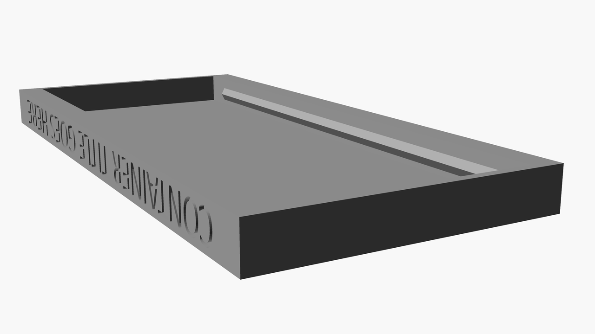

# Three part container

This is a design for a three part container that can be used to store objects.

The container is printed from `front`, `back` and `lid` elements.

After printing all of the elements, the `front` and `back` elements should be glued together. Simply put some strong glue into the guides on the left and right side of the `front` element. Then, press the `back` element against it, which has shapes triangle-shaped elements that go into the guides.

The lid can be printed as is and simply put at the top of the container - it will fit right in after `front` and `back` after glued together.

The small guides at the top of `front` and `back` elements are meant for the triangle-shaped element in the `lid` - which allows for convenient closing of the container.

This container size and text can be configured using the OpenSCAD variables documented below.

# three-part-container-back.scad

[Output STL file in 3D preview](./three-part-container-back.stl)

# three-part-container-front.scad

[Output STL file in 3D preview](./three-part-container-front.stl)

# three-part-container-lid.scad

[Output STL file in 3D preview](./three-part-container-lid.stl)

**NOTE**: This elements of this design has to be printed with supports enabled for the text to be embedded correctly.

## Customizations

The following are key variables that can be customized in the OpenSCAD files:

| Variable             | Default | Unit | Description                                                                                                       |
|----------------------|---------|------|-------------------------------------------------------------------------------------------------------------------|
| container_width      | 85      | mm   | Width of the inside of the container (excluding the frame of the container)                                       |
| container_height     | 114.5   | mm   | Height of the inside of the container (excluding the frame of the container)                                      |
| container_depth      | 30      | mm   | Depth of the inside of the container (excluding the frame of the container)                                       |
| title                | N/A     | text | (only in `lid` element) The text to embed in the lid of the container                                             |
